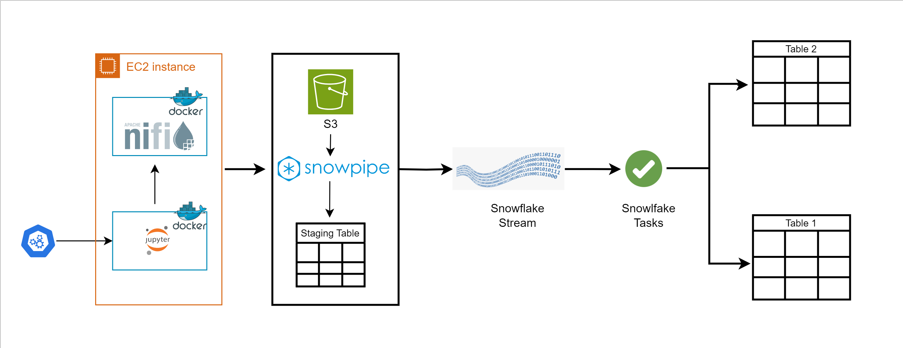

## Project: Slowly Changing Dimensions in Snowflake Using Streams and Tasks

### Introduction
This project implements a real-time data pipeline for continuous data ingestion and transformation into a Snowflake data warehouse. It leverages various cloud technologies to achieve Change Data Capture (CDC) and Slowly Changing Dimensions (SCD) for historical data management.

### Architecture

### Tech Stack:
➔ Languages: Python3, JavaScript, SQL  
➔ Services: NiFi, Amazon S3, Snowflake, Amazon EC2, Docker

### Dataset Description:
In this project, we use the faker library from Python to generate records of users and store the records in CSV format with the name, including the current system time. The data includes the following parameters:
- Customer_id
- First_name
- Last_name
- Email
- Street
- State
- Country

### Process Flow
- Data Generation (EC2): Python scripts with Faker generate data and store it in a designated folder.
- Data Movement (Apache NiFi): Apache NiFi monitors the folder and uploads newly created files to the designated S3 bucket.
- Data Ingestion (Snowpipe): Snowpipe automatically ingests data from the S3 bucket into a staging table in Snowflake.
- Data Transformation (Snowflake Stored Procedure): A scheduled task triggers the stored procedure every minute:
- MERGE Command (CDC): Inserts, updates, or deletes data in the target table based on the staging table.
- Truncate Staging Table: Prepares the staging table for the next batch of data.
- Historical Data Management (Snowflake Stream): A Snowflake Stream captures changes to the actual table over time.
- SCD(Slowly Changing Dimension) Implementation: The captured data populates a historical table designed with SCD techniques.

### Key Takeaways:
- Understanding the basics of SCD and its different types.
- Visualizing the complete Architecture of the system
- Understanding the project and how to use AWS EC2 Instance and security groups.
- Introduction to Docker.
- Docker Installation and execution.
- Usage of docker-composer and starting all tools.
- Creation of Access key.
- Creation of S3 bucket.
- Test Data preparation.
- Understanding basics of NiFi.
- Integrating NiFi with S3.
- Implementing NiFi flow setup.
- Introduction to different Snowflake components.
- Implementation of different Snowflake components.
- Implementation of SCD Type-1 and Type-2

### Benefits
- Real-time Data Pipeline: Enables near real-time data updates in Snowflake.
- Change Data Capture (CDC): Ensures the target table reflects the latest data through inserts, updates, and deletes.
- Slowly Changing Dimensions (SCD): Maintains data integrity in the historical table through SCD techniques.
- Scalability and Manageability: Cloud-based technologies offer scalability for handling large data volumes.

### FAQs

#### What is Slowly Changing Dimensions?
The terms "facts" and "dimensions" are used in data warehousing. A fact is a piece of numerical data, such as a sale or clicks. Facts are stored in fact tables, linked to a variety of dimension tables via foreign keys that act as companion tables to the facts. Dimension Attributes are the different columns in a dimension table that provide descriptive features of the facts.

A Slowly Changing Dimension (SCD) stores and maintains both current and historical data across time in a data warehouse. It is regarded as one of the essential ETL jobs for monitoring the history of dimension records, and it has been implemented. Customer, geography, and employee are examples of such dimensions.

SCD may be approached in a variety of ways. The most popular ones are:

- **Type 0**: This is a passive method. When the dimensions change in this approach, no particular
action is taken. Some dimension data can be kept the same as when it was initially entered,
while others may be replaced.

- **Type 1**: The new data overwrites the previous data in a Type 1 SCD. As a result, the existing data
is lost because it is not saved elsewhere. This is the most common sort of dimension one will
encounter. To make a Type 1 SCD, one does not need to provide further information.

- **Type 2**: The complete history of values is preserved in a Type 2 SCD. The current record is closed
when the value of a particular attribute changes. With the updated data values, a new record is
generated, which then becomes the current record. Each record's adequate time and expiry
time are used to determine the period during which the record was active.

- **Type 3**: For some chosen dimensions, a Type 3 SCD maintains two copies of values. The previous
and current values of the chosen attribute are saved in each record. When the value of any of
the chosen attributes changes, the latest value is recorded as the current value, and the
previous value is saved as the old value in a new column.

#### NiFi
Apache NiFi is a data logistics platform that automates data transfer across systems. It gives real-time control over data transportation from any source to any destination, making it simple to handle.

#### Docker
Docker is a containerization platform that is available as an open-source project. It allows developers to bundle programs into containers, which are standardized executable components that combine application source code with the OS libraries and dependencies needed to run that code in any environment.

#### Amazon EC2
In the Amazon Web Services Cloud, the Amazon Elastic Compute Cloud (Amazon EC2) offers scalable computing capability. The user will not have to buy hardware upfront if Amazon EC2 is used. Amazon EC2 allows developers to launch multiple virtual servers based on usage, set security and networking, and manage storage.

#### Amazon S3
Amazon S3 is an object storage service that provides manufacturing scalability, data availability, security, and performance. Users may save and retrieve any quantity of data using Amazon S3 at any time and from any location.

#### Snowflake
Snowflake is a data storage, processing, and analytics platform that blends a unique SQL query engine with a cloud-native architecture. Snowflake delivers all the features of an enterprise analytic database to the user. Snowflake components include:
- Warehouse/Virtual Warehouse
- Database and Schema
- Table
- View
- Stored procedure
- Snowpipe
- Stream
- Task

