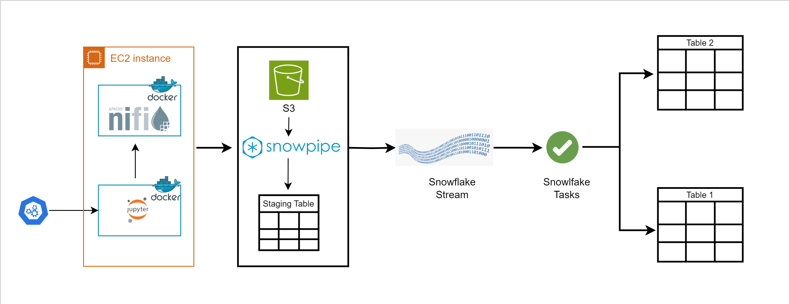

## Project: Slowly Changing Dimensions in Snowflake Using Streams and Tasks

### Introduction

This project implements a real-time data pipeline for continuous data ingestion and transformation into a Snowflake data warehouse. It leverages various cloud technologies to achieve Change Data Capture (CDC) and Slowly Changing Dimensions (SCD) for historical data management.

### Architecture



### Tech Stack

| Layer | Technology |
|---|---|
| Languages | Python 3, SQL |
| Infrastructure as Code | Terraform |
| Data Generation | Python Faker library |
| Data Movement | Apache NiFi (Docker) |
| Cloud Storage | Amazon S3 |
| Compute | Amazon EC2 |
| Data Warehouse | Snowflake |
| Containerization | Docker, Docker Compose |

### Dataset

Customer records are generated using the Python `faker` library and stored as timestamped CSV files with the following fields:

- `customer_id`
- `first_name`
- `last_name`
- `email`
- `street`
- `city`
- `state`
- `country`

---

### Infrastructure (Terraform)

All AWS resources are provisioned via Terraform. See [`terraform/terrafrom-commands.md`](./terraform/terrafrom-commands.md) for full setup instructions.

**Resources created:**

| Resource | Name |
|---|---|
| S3 Bucket | `s3-scd-warehousing-us-west-2-tf` |
| EC2 Instance | `ec2-scd-warehousing-us-west-2-tf` |
| IAM Role | `ec2-scd-warehousing-us-west-2-tf-role` |
| Instance Profile | `ec2-scd-warehousing-us-west-2-tf-profile` |
| Security Group | `ec2-scd-warehousing-us-west-2-tf-sg` |
| Key Pair | `ec2-scd-warehousing-us-west-2-tf-key` |

**Quick start:**

```bash
cd terraform
terraform init
terraform apply --auto-approve
```

Fix PEM permissions on Windows after apply:

```
icacls "ec2-scd-warehousing-us-west-2-tf.pem" /inheritance:r
icacls "ec2-scd-warehousing-us-west-2-tf.pem" /grant:r "%USERNAME%:R"
```

---

### Process Flow

1. **Data Generation (EC2)** — Python scripts using `faker` generate customer CSV files and place them in a watched folder inside the NiFi container.

2. **Data Movement (Apache NiFi)** — NiFi monitors the folder with a `ListFile → FetchFile → PutS3Object` flow and uploads new files to the S3 bucket.

3. **Data Ingestion (Snowpipe)** — Snowpipe auto-ingests CSV files from S3 into the `customer_raw` staging table in Snowflake.

4. **Data Transformation (Snowflake Task + Stored Procedure)** — A scheduled task runs every minute and triggers a stored procedure that:
   - Merges `customer_raw` into the `customer` table (CDC: insert / update / delete)
   - Truncates `customer_raw` to prepare for the next batch

5. **Change Capture (Snowflake Stream)** — A stream on the `customer` table captures all row-level changes.

6. **Historical Data (SCD)** — Captured changes populate the `customer_history` table using SCD Type-1 and Type-2 techniques.

---

### Snowflake Objects

| Object | Name | Purpose |
|---|---|---|
| Database | `scd_demo` | Project database |
| Schema | `scd2` | Project schema |
| Table | `customer_raw` | Staging table (Snowpipe target) |
| Table | `customer` | Current state table |
| Table | `customer_history` | Historical SCD table |
| Stream | `customer_table_changes` | Captures changes on `customer` |
| Pipe | `customer_s3_pipe` | Auto-ingest from S3 |
| Warehouse | `COMPUTE_WH` | XSMALL, auto-suspends after 120s |

---

### Docker Services

NiFi and JupyterLab run on the EC2 instance via Docker Compose. NiFi and JupyterLab are accessed locally via SSH port forwarding (no extra security group rules needed).

```bash
# Transfer docker-compose to EC2 and start services
scp -r -i "ec2-scd-warehousing-us-west-2-tf.pem" docker_exp ec2-user@<EC2_PUBLIC_DNS>:/home/ec2-user/docker_exp
ssh -i "ec2-scd-warehousing-us-west-2-tf.pem" ec2-user@<EC2_PUBLIC_DNS> -L 2080:localhost:2080 -L 4888:localhost:4888

cd docker_exp && docker-compose up -d
```

- NiFi UI: `http://localhost:2080/nifi/`
- JupyterLab: `http://localhost:4888/lab`

---

### SCD Types

- **Type 1** — Overwrites existing data with the latest values. No history is kept.
- **Type 2** — Preserves full history. Each change closes the current record (`end_time`, `is_current = false`) and inserts a new active record.

---

### Key Takeaways

- End-to-end cloud data pipeline from data generation to historical storage
- Infrastructure as Code with Terraform for repeatable AWS provisioning
- Change Data Capture (CDC) using Snowflake MERGE and Streams
- SCD Type-1 and Type-2 implementation in Snowflake
- Apache NiFi for automated file-to-S3 data movement
- Docker for portable service deployment on EC2
